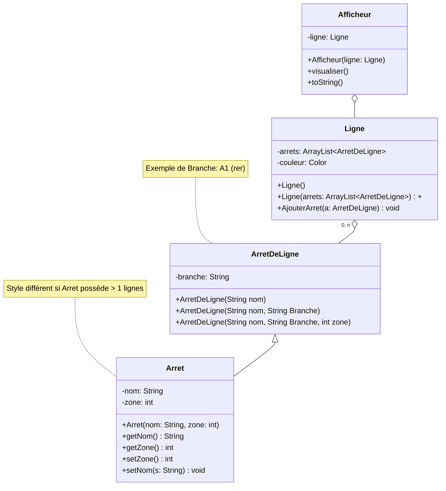

# Afficheur d'une ligne type RER/Transport

```mermaid
classDiagram
note for Arret "Style différent si Arret possède > 1 lignes"
class Arret {
-nom: String
-zone: int
+Arret(nom: String, zone: int)

+getNom() String
+getZone() int

+setZone() int
+setNom(s: String) void
}

note for ArretDeLigne "Exemple de Branche: A1 (rer)"
class ArretDeLigne {
-branche: String
+ArretDeLigne(String nom)
+ArretDeLigne(String nom, String Branche)
+ArretDeLigne(String nom, String Branche, int zone)
}

class Ligne {
-arrets: ArrayList~ArretDeLigne~
-couleur: Color
+Ligne()
+Ligne(arrets: ArrayList~ArretDeLigne~)+
+AjouterArret(a: ArretDeLigne) void
}

class Afficheur {
-ligne: Ligne
+Afficheur(ligne: Ligne)
+visualiser()
+toString()
}

ArretDeLigne <|-- Arret
Ligne "0..n" o-- "1...n" ArretDeLigne
Afficheur o-- Ligne
```